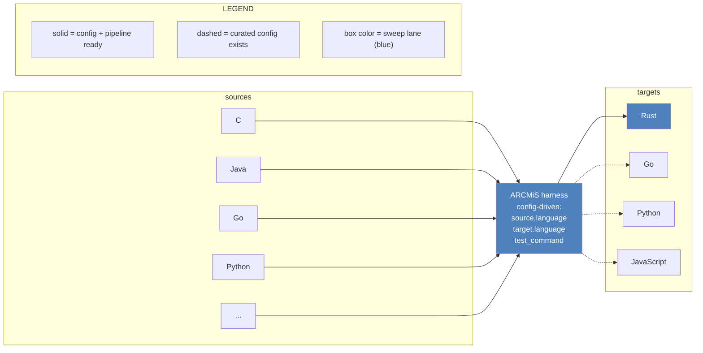
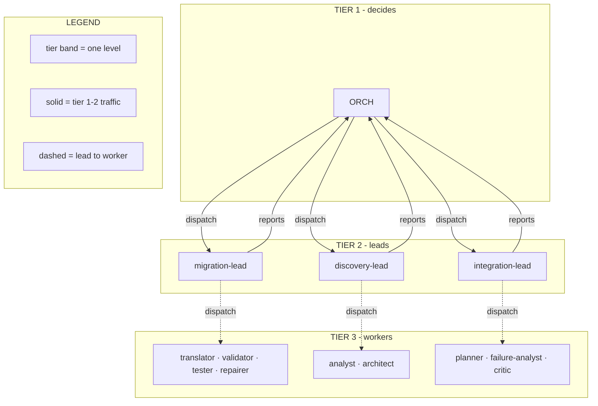
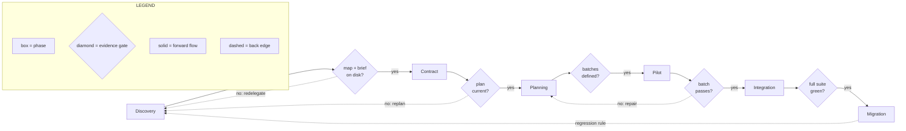
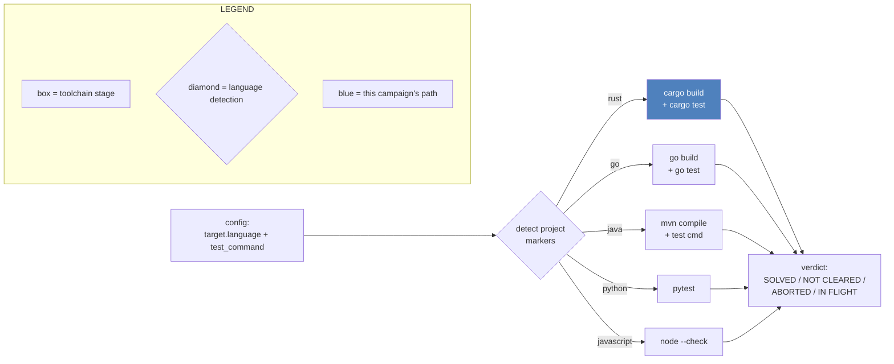
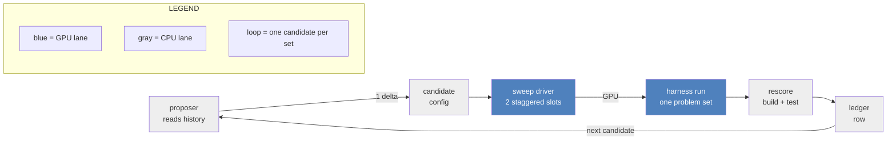
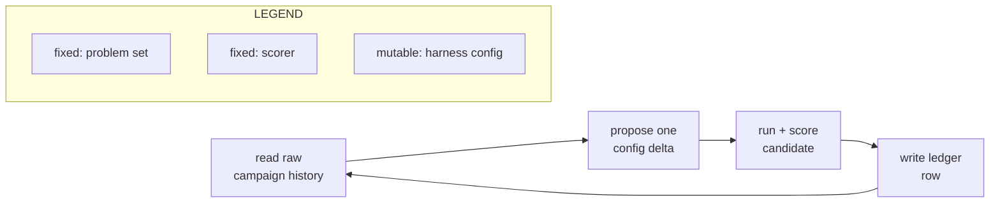
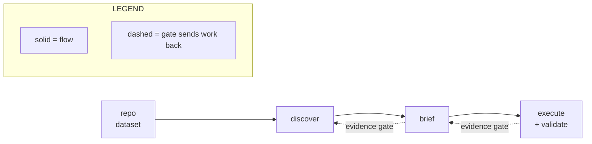
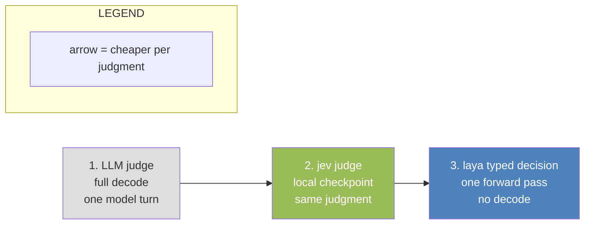

# ARCMiS

<div class="mt-2 flex items-center gap-4">
  <div class="flex flex-col gap-1">
    <div class="logo-bar" style="width:88px"></div>
    <div class="logo-bar" style="width:62px"></div>
    <div class="logo-bar" style="width:36px"></div>
  </div>
  <h1 class="!text-6xl !mt-0">ARCMiS</h1>
</div>

<p class="text-2xl mt-6" style="color:#1F497D">Agentic Repository-Level Code Migration for Small Language Models</p>

<p class="text-lg mt-2 text-gray-700">A hierarchical multi-agent harness that migrates legacy code between languages and proves every result with the toolchain. Coverage target now: C to Rust.</p>

<div class="absolute bottom-14 left-12 text-sm text-gray-600">
  <p><strong>ARCMiS team</strong></p>
  <p>University of Engineering and Technology, Vietnam National University, Hanoi</p>
  <p>hanhdd@vnu.edu.vn · 23021534@vnu.edu.vn</p>
  <p>Repo: ARCMiS · docs/adr · docs/report · 2026-10-06</p>
</div>

<!-- Title slide: monogram mark, full name, pitch, author block
     bottom-left per the resdir master. Authors and affiliation from
     docs/report/paper.tex. -->

---
layout: default
---

# Contents

1. Introduction: what problem does ARCMiS solve?
2. Methodology: agents, rounds, gates, scoring, and the sweep
3. Inspirations: prior work this design builds on
4. Benchmarks: live campaign numbers
5. References

<!-- Section list of the deck -->

---
layout: section
title: Introduction
---

# Introduction

<!-- Section divider -->

---
layout: default
---

# What is code migration?

- Migration moves working code from one language to another.
- The new code must do the same job and pass the same tests.
- Many codebases still run on legacy C, Java, Go, and Python.
- Hand migration is slow. Each module needs the same steps: read,
  plan, translate, test.
- ARCMiS runs these steps with agents. The source and target languages
  are config, not code. The coverage sweep in this campaign runs C and
  Go sources to Rust targets.

<div class="grid grid-cols-2 gap-4 mt-4 text-sm">

```c
/* C: raw pointer, raw length */
void scale(float* buf, int n, float k) {
    for (int i = 0; i < n; i++)
        buf[i] *= k;
}
```

```rust
// Rust: slice, bounds checked
fn scale(buf: &mut [f32], k: f32) {
    for x in buf.iter_mut() {
        *x *= k;
    }
}
```

</div>

<p class="text-xs text-gray-500 mt-2">Worked example, C to Rust (the campaign's demonstration case, not the project's scope). The pointer becomes a slice. Rust checks every access at compile time.</p>

<!-- Migration problem with a tiny C to Rust example -->

---
layout: default
---

# Why automate migration?

- Large codebases have hundreds of small modules.
- Each module needs the same steps: read, plan, translate, test.
- A single LLM call cannot hold a whole repository.
- An agent can call tools: read files, write files, run builds.
- ARCMiS coordinates many agents to cover one module set after another.

| Step | Done by | Checked by |
|---|---|---|
| Read and map the source | agents | source map on disk |
| Plan the port | agents | plan file on disk |
| Translate to the target language | agents | target build command |
| Prove | agents | target test command |

<!-- Automation rationale. -->

---
layout: default
---

# Any source language, any target



- The config carries `source.language`, `target.language`, and
  `test_command` per problem (`lib/agents/src/util/config.rs`).
- Curated configs cover C, Go, and Java sources. 20 targets use Rust,
  plus Python and JavaScript targets in `assets/configs/`.
- Coverage sweep in this campaign: C and Go sources to Rust targets,
  toolchain-scored.

<!-- Language generality: config surface vs campaign instantiation. -->

---
layout: default
---

# Why multi-agent?

One agent alone fails in known ways:

- It forgets the plan when the context fills up.
- It claims success without running the toolchain.
- One long task burns the whole time budget.
- A dead end (bad port idea) has no second opinion.

The ARCMiS answers:

<div class="grid grid-cols-3 gap-4 text-sm mt-2">
<div class="p-2 border rounded" style="border-color:#4F81BD">

**Division of labor**
Each role has one job and its own context.

</div>
<div class="p-2 border rounded" style="border-color:#4F81BD">

**Delegation**
The orchestrator dispatches. Leads check the work.

</div>
<div class="p-2 border rounded" style="border-color:#4F81BD">

**Evidence gates**
A claim counts only with a file or a green test behind it.

</div>
</div>

<!-- Single agent failure modes and the multi-agent answers. -->

---
layout: default
---

# The agent cast

| Role | Tier | Tools | Output |
|---|---|---|---|
| orchestrator | 1 | none: DECISION grammar only | dispatches, phase exits |
| discovery-lead | 2 | dispatch, read | source map, brief |
| migration-lead | 2 | dispatch, read | translated batches |
| integration-lead | 2 | dispatch, read | merged tree, test runs |
| analyst, architect | 3 | read, find, write | maps, briefs |
| translator, repairer | 3 | read, write, edit | target-language source |
| validator, tester | 3 | read, target build/test | pass or fail reports |
| planner, failure-analyst, critic | 3 | read, write | plans, triage notes |

- Tier 1 decides. Tier 2 leads one work area each. Tier 3 runs the tools.
- Config-owned team split: `ARCMiS/lib/orchestrator/src/hierarchy.rs`.

<!-- Role table: role, tier, tools, output. -->

---
layout: default
---

# Words this deck uses

| Word | Meaning |
|---|---|
| round | one decision cycle: dispatch, results, next decision |
| phase | one migration stage: Discovery to Migration |
| gate | an evidence check before a phase exit |
| breaker | a stop rule for runs without progress |
| delegation | one dispatch of a task to a lead or specialist |
| candidate | one harness config under test |
| problem set | one project to migrate (one directory) |
| ledger | one row per round in `ROUNDS.yaml` |
| verdict | the scored outcome of one round |

<!-- Glossary for zero-knowledge readers. -->

---
layout: section
title: Methodology
---

# Methodology

<!-- Section divider -->

---
layout: default
---

# The MAS hierarchy



- Tier 1 owns the round loop and the task graph.
- Tier 2 splits work and checks acceptance.
- Tier 3 never talks to tier 1 directly.

<!-- MAS hierarchy with tier bands and labeled arrows. -->

---
layout: default
---

# Life of a round: the state machine



- Each diamond asks for evidence on disk, not for a claim.

<!-- Round lifecycle state machine with gates and back edges. -->

---
layout: default
---

# What each phase must prove

| Phase | Exit evidence (the gate checks it) |
|---|---|
| Discovery | `source-map.md` + `brief.md`, every module cited |
| Contract | target architecture + plan, current on disk |
| Planning | translation batches, each with an acceptance check |
| Pilot | first batch translated, `cargo build` green |
| Integration | full tree merged, `cargo test` 0 failed |
| Migration | final validation, workspace scored by the toolchain |

- A phase exit without the file is refused by the gate.
- Failed gates send the round back, not forward.

<!-- Phase exit evidence table. Command names are the campaign
     instantiation (Rust targets). Gates check the same artifact
     classes for any target. -->

---
layout: default
---

# How a round works, step by step

1. The orchestrator reads the plan and the task graph.
2. It writes one short task with the DECISION grammar.
3. It dispatches the task to a lead.
4. The lead splits the task and dispatches specialists.
5. Specialists run tools and write artifacts.
6. The lead checks the acceptance clause and reports.
7. The gate checks phase evidence. Pass: next phase. Fail: back edge.
8. The ledger records the round: verdict, counters, artifacts.

- One round = steps 1 to 8. A run = many rounds through 6 phases.
- Rounds continue until a gate exits the last phase or a breaker stops the run.

<!-- Numbered walkthrough, references the state machine. -->

---
layout: default
---

# Safety rails: gates and breakers

A run can waste hours. These rules stop it:

| Rail | Trigger | Action |
|---|---|---|
| evidence gate | exit claim without files | refuse the exit |
| stagnation breaker | 3 rounds, no completed task | close the run |
| round cap | 20 rounds | close the run |
| MaxTurns limit | member exceeds its turn budget | member dies, lead retries |
| output cap | answer over 8192 tokens | retry with a tighter task |
| engine 503 | engine overloaded | backoff, then retry |

- Every trip lands in the ledger row for that round.

<!-- Breakers and gates. -->

---
layout: default
---

# How scoring works

`scripts/rescore.py` runs after every round. No model self-grading.

1. Run the target build command on the produced workspace.
2. Run the target test command on the same workspace.
3. Count: tests passed, tests failed. Write `result/per_problem.json`.

| Verdict | Meaning |
|---|---|
| SOLVED | build green, tests pass, round complete |
| NOT CLEARED | run closed without a verified workspace |
| ABORTED | engine or launcher failure, no verdict earned |
| IN FLIGHT | round still running |

- Only the toolchain decides. A model claim is never a verdict.
- Campaign instantiation: the commands are `cargo build` and
  `cargo test`. The scoring path is demonstrated on Rust targets in
  this campaign.

<!-- Scoring pipeline and verdict classes. -->

---
layout: default
---

# Scoring generality: one scorer, many toolchains



- The scorer reads project markers, then runs the matching toolchain.
  Rust, Go, Java, Python, and JavaScript paths are implemented.
- Every sweep round in this campaign ran Rust targets, including the
  python-source and java-source problems. The scoring table above
  counts them all as Rust-target rounds.
- The sweep template still pins Rust targets. Non-Rust rounds have
  not been scored yet.

<!-- Scoring generality with honest campaign limitation. -->

---
layout: default
---

# What the ledger records

Every round writes one row to `ROUNDS.yaml`:

| Field group | Fields |
|---|---|
| identity | round id, protocol, candidate id |
| intent | hypothesis, defect class targeted |
| cost | wall seconds, stalled rounds |
| deaths | max-turns deaths, output-cap deaths |
| result | compile, tests passed, tests failed |
| lineage | parents, delta vs parent, regression flags |
| outcome | verdict, artifact paths |

- The ledger is the campaign memory. Every retry keeps its own row.

<!-- Ledger fields. -->

---
layout: default
---

# Reading the results

- A problem clears when one round scores a verified workspace.
- A problem counts once across retries.
- NOT CLEARED may retry with a fix or a fresh config.
- ABORTED means no verdict. The retry starts from the same state.
- The scoreboard counts problems, not rounds.

<p class="text-sm mt-2">Example: run s31 spent <strong>14.7 h</strong> on remimu, finished 12 of 13
tasks, hit the round cap, and scored NOT CLEARED. The ledger row keeps
the full counter set, so the retry starts from a known state.</p>

<!-- Verdict interpretation and retry policy. -->

---
layout: default
---

# The coverage sweep pipeline



- GPU lane: one set at a time, LoC ascending, two staggered slots.
- CPU lane: proposer and scorer run while the GPU works.
- Coverage rule: untouched projects only. Pairs mix one crust set with
  one non-crust set.
- Campaign instantiation: Rust targets with the cargo toolchain.

<!-- Sweep pipeline with GPU and CPU lanes and the loop. -->

---
layout: default
---

# The harness evolution loop

The harness itself changes between candidates:



- The problem set and the scorer stay fixed.
- One candidate changes one thing, so the ledger shows cause and effect.

<!-- Harness evolution loop, neutral wording. -->

---
layout: section
title: Inspirations
---

# Inspirations

<!-- Section divider -->

---
layout: default
---

# Orchestration patterns: the two axes

Source: the LLM multi-agent orchestration survey (the "Q2 survey").

| | static agents | dynamic-adaptive |
|---|---|---|
| **centralized** | one boss, fixed roles | one boss, routing at runtime |
| **decentralized** | peer teams, fixed links | peers that renegotiate |
| **hierarchy** | fixed tree of teams | **ARCMiS sits here** |

- Hierarchy: tier-2 leads over tier-3 specialists. Verified in
  `hierarchy.rs` and `lead.rs`. Recorded in ADR 0022 and ADR 0026.
- Dynamic: the task graph re-scores after each delegation, and the
  orchestrator can spawn a failure-analyst chain mid-task.
- Static part: fixed role registry, fixed preambles, fixed tool
  allowlists. The selection is dynamic. The agents are not.

<!-- Taxonomy mapping slide. -->

---
layout: default
---

# Modernization workflows



**ReCodeAgent** (arXiv:2604.07341, ASE 2026):

- A multi-agent workflow for repository translation and validation.
- ARCMiS borrows the `tool_projects` dataset and the stage discipline
  (ADR 0018, ADR 0022).

**Claude Modernization Plugin:**

- Discovery, brief, and execution flow with evidence-gated phase exits.
- ARCMiS borrows the gate idea: an exit needs evidence, not a claim.

<!-- Modernization workflow sources. -->

---
layout: default
---

# System-one models: jev and laya

Judgments cost model turns. Three cheaper rungs exist:



- LLM judge: one full decode per judgment, on the busy GPU.
- jev judge: the same judgment from a local specialist checkpoint.
  `jev_judge.rs` (ADR 0023), `jev_triage.rs` (ADR 0027).
- laya (arXiv:2609.26550): one forward pass answers `choice`, `score`,
  and `noul`. See `.omp/skills/laya`.

<!-- Judge ladder. -->

---
layout: default
---

# Where triage is wired today

- Each member dispatch gets a typed triage verdict.
  Five `agent_trace_observability` questions, min-confidence cascade.
- Each round gets a laya consultation over its own counters
  (ADR 0028).

**Honest state:** the round policy defaults to `observe`
(`round_triage/policy.rs`). The harness records every verdict. No round
stops on one. Enforcement (`policy: enforce`) exists and is not the
campaign default.

- Measured round confidences sit near 0.31 to 0.33, below the 0.9
  cascade threshold. The judge falls back on today's data. Reported as
  measured. Not tuned to force agreement.

<!-- Honest wiring state. Verified: round_triage/policy.rs, ADR 0028. -->

---
layout: section
title: Benchmarks
---

# Benchmarks

<!-- Section divider -->

---
layout: default
---

# The dataset

`assets/ReCodeAgent/data/tool_projects`, four families:

<div class="text-sm mt-2">
<div class="flex items-center gap-2 mb-1"><div class="bar bar-blue" style="width:520px"></div><span>crust 100</span></div>
<div class="flex items-center gap-2 mb-1"><div class="bar bar-green" style="width:42px"></div><span>skel 8</span></div>
<div class="flex items-center gap-2 mb-1"><div class="bar bar-purple" style="width:37px"></div><span>oxidizer 7</span></div>
<div class="flex items-center gap-2 mb-1"><div class="bar bar-orange" style="width:21px"></div><span>alphatrans 4</span></div>
</div>

- Counted on disk: 4 + 100 + 7 + 8 = **119 directories**.
- The campaign brief says **114**. The delta is 5 problems.
- Slides below use the brief number 114 and say so.

<!-- Dataset families with a bar visual. -->

---
layout: default
---

# Progress: 13 of 114 problems cleared

<div class="flex flex-wrap gap-1 max-w-125 my-2">
<span v-for="i in 114" :key="i" class="dot" :class="i <= 13 ? 'dot-ok' : 'dot-todo'"></span>
</div>

<p class="text-sm"><strong>13 green</strong> = one verified workspace per problem.
Each dot is one problem.</p>

| Family | Problems | Cleared |
|---|---|---|
| crust | 100 | 11 |
| oxidizer | 7 | 1 |
| skel | 8 | 1 |
| alphatrans | 4 | 0 |

- A problem counts once across retries.
- The cleared set includes python-source (colorsys) and go-source
  (gonameparts) problems. All scored as Rust-target rounds.
- Live: wave 3 of the coverage sweep, 1 round in flight (2026-10-06).

<!-- Dot grid: 114 dots, first 13 green = one verified workspace per
     cleared problem. Count from the ledger. The loop only draws the
     grid. -->

---
layout: default
---

# Round verdicts so far

55 ledger rows, counted live from `ROUNDS.yaml` (2026-10-06):

<div class="text-sm mt-2">
<div class="flex items-center gap-2 mb-1"><span class="w-30">SOLVED</span><div class="bar bar-green" style="width:452px"></div><span>19</span></div>
<div class="flex items-center gap-2 mb-1"><span class="w-30">NOT CLEARED</span><div class="bar bar-red" style="width:500px"></div><span>21</span></div>
<div class="flex items-center gap-2 mb-1"><span class="w-30">ABORTED</span><div class="bar bar-gray" style="width:333px"></div><span>14</span></div>
<div class="flex items-center gap-2 mb-1"><span class="w-30">IN FLIGHT</span><div class="bar bar-blue" style="width:24px"></div><span>1</span></div>
</div>

- One problem can span several rounds. A retry keeps its own row.
- ABORTED rows are engine or launcher failures, not harness verdicts.

<!-- Verdict breakdown bar chart, pure HTML/CSS. -->

---
layout: default
---

# Wall clock: solved runs vs failed runs

Serial-era solved median: **145 min** (n=15). Three wave-2 failures:

<div class="relative text-sm mt-4 ml-34" style="height:120px">
  <div class="absolute top-0 bottom-0 median-line"></div>
  <div class="absolute -top-5 median-label" style="left:60px">median 145 min</div>
  <div class="flex items-center gap-2 absolute top-4"><span class="w-32">fft 36 min</span><div class="bar bar-red" style="width:19px"></div></div>
  <div class="flex items-center gap-2 absolute top-11"><span class="w-32">bst 133 min</span><div class="bar bar-red" style="width:70px"></div></div>
  <div class="flex items-center gap-2 absolute top-18"><span class="w-32">remimu 885 min</span><div class="bar bar-red" style="width:466px"></div></div>
</div>

<div class="text-xs text-gray-600 mt-16">
green = solved run · red = not cleared · dashed line = solved median
</div>

- A failure can end fast (fft, stuck at Planning) or run long (remimu,
  5 of 5 batches translated, then the round cap).
- remimu took 6 times the median and still did not clear.

<!-- Wall clock comparison with median line. -->

---
layout: default
---

# Where the tokens go: one failed run

The remimu round (s31, 14.7 h, NOT CLEARED at the round cap):

<div class="text-sm mt-2">
<div class="flex items-center gap-2 mb-1"><span class="w-42">input tokens</span><div class="bar bar-blue" style="width:500px"></div><span>39.3M</span></div>
<div class="flex items-center gap-2 mb-1"><span class="w-42">output tokens</span><div class="bar bar-blue" style="width:12px"></div><span>783k</span></div>
<div class="flex items-center gap-2 mb-1"><span class="w-42">of output: think burn</span><div class="bar bar-purple" style="width:6px"></div><span>~30%</span></div>
</div>

Deaths along the way (red = run-stopping class):

<div class="text-sm mt-2">
<div class="flex items-center gap-2 mb-1"><span class="w-42">MaxTurns deaths</span><div class="bar bar-red" style="width:500px"></div><span>30</span></div>
<div class="flex items-center gap-2 mb-1"><span class="w-42">Length (output cap) deaths</span><div class="bar bar-red" style="width:150px"></div><span>9</span></div>
<div class="flex items-center gap-2 mb-1"><span class="w-42">admission 503s</span><div class="bar bar-gray" style="width:133px"></div><span>8</span></div>
</div>

<p class="text-xs text-gray-600 mt-1">Legend: blue = tokens, purple = wasted output, red = member deaths, gray = engine overload.</p>

<!-- Token flow and death census for one failed run. -->

---
layout: default
---

# Comparison with ReCodeAgent

| | ReCodeAgent | ARCMiS |
|---|---|---|
| model | Claude 4.5 Sonnet | qwen3.8-27B, local |
| protocol | their developer-test suites | toolchain-only scoring |
| scale | 118 projects | one set at a time |

<div class="text-sm mt-4">
<div class="flex items-center gap-2 mb-1"><span class="w-40">RCA compile</span><div class="bar bar-blue" style="width:497px"></div><span>99.4%</span></div>
<div class="flex items-center gap-2 mb-1"><span class="w-40">RCA test pass</span><div class="bar bar-blue" style="width:433px"></div><span>86.5%</span></div>
<div class="flex items-center gap-2 mb-1"><span class="w-40">ARCMiS cleared</span><div class="bar bar-green" style="width:57px"></div><span>13/114 = 11.4%</span></div>
</div>

<p class="text-xs text-gray-600 mt-1">Different protocol: ARCMiS has no aggregate compile percent.
The green bar is problems cleared under a stricter, toolchain-only gate.
Directional context, not a like-for-like comparison.</p>

<!-- ReCodeAgent comparison with bars and protocol label. -->

---
layout: default
---

# Estimated time to finish

- Campaign start: 2026-09-26. Elapsed: 10 days (2026-10-06).
- Rate so far: 13 cleared / 10 days = about 1.3 per day.
- Remaining: (114 - 13) / 1.3 = about **78 days**.

<p class="text-sm mt-2">This is an estimate from the current rate, not a
commitment. The rate changes with problem size. The LoC walk now reaches
larger sets, so later problems cost more per set.</p>

<!-- Rate based estimate, labeled as estimate. -->

---
layout: section
title: References
---

# References

<!-- Section divider -->

---
layout: default
---

# References

- ReCodeAgent: A Multi-agent Workflow for Language-Agnostic
  Translation and Validation of Large-Scale Repositories.
  arXiv:2604.07341, ASE 2026.
- LLM-Based Multi-Agent Orchestration: A Survey of Frameworks,
  Communication Protocols, and Emerging Patterns (the Q2 survey).
- Typed decisions. arXiv:2609.26550. laya-rs crate, `.omp/skills/laya`.
- ARCMiS ADRs 0018, 0022, 0023, 0026, 0027, 0028, 0029 in `docs/adr/`.
- Dataset: `assets/ReCodeAgent/data/tool_projects`.
- Ledger: `.artifacts/experiments/ROUNDS.yaml` and `SUMMARY.md`.

<!-- Reference list slide. -->

---
layout: end
---

# Thank you

<!-- Closing slide. -->
