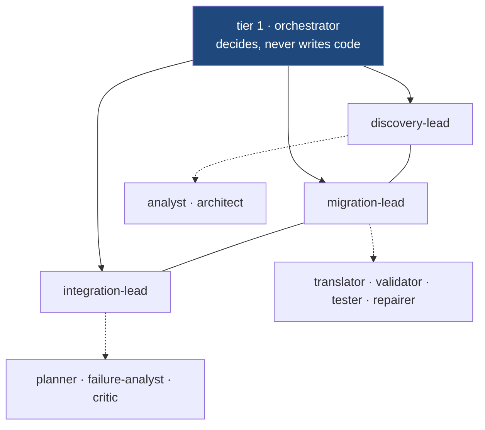
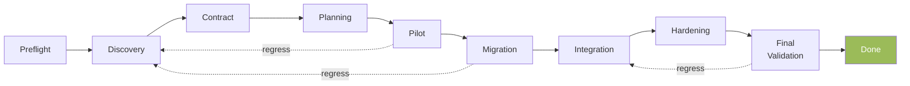
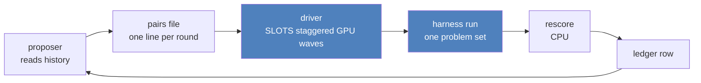
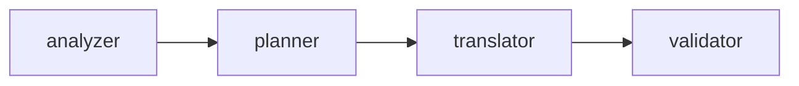
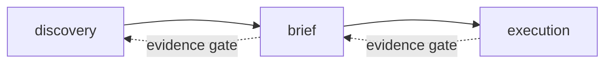
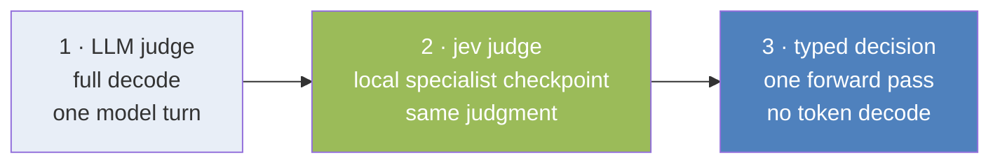

<div class="mt-24 flex items-center gap-6">
  <div class="flex flex-col gap-1.5">
    <div class="logo-bar" style="width:96px"></div>
    <div class="logo-bar" style="width:66px"></div>
    <div class="logo-bar" style="width:38px"></div>
  </div>
  <h1 class="!text-7xl !mt-0">ARCMiS</h1>
</div>

<p class="text-2xl mt-8 text-gray-800">Agentic Repository-Level Code Migration<br/>for Small Language Models</p>

<div class="absolute bottom-16 left-12 text-base text-gray-700 leading-6">
  <p>Duc-Hanh Dang &nbsp;·&nbsp; Tu-Duc Nguyen</p>
  <p>University of Engineering and Technology, VNU Hanoi</p>
  <p>hanhdd@vnu.edu.vn &nbsp;·&nbsp; 23021534@vnu.edu.vn</p>
  <p class="mt-1 text-gray-500">2026-10-06</p>
</div>

<!-- Title. Authors and affiliation from docs/report/paper.tex. -->

---
layout: default
---

# Contents

<div class="mt-8 space-y-6">
  <div class="flex items-baseline gap-6"><span class="toc-num">1</span><span class="text-2xl">Introduction</span></div>
  <div class="flex items-baseline gap-6"><span class="toc-num">2</span><span class="text-2xl">Methodology</span></div>
  <div class="flex items-baseline gap-6"><span class="toc-num">3</span><span class="text-2xl">Inspirations</span></div>
  <div class="flex items-baseline gap-6"><span class="toc-num">4</span><span class="text-2xl">Benchmarks</span></div>
  <div class="flex items-baseline gap-6"><span class="toc-num">5</span><span class="text-2xl">References</span></div>
</div>

<!-- Section list. -->

---
layout: section
title: Introduction
---

# Introduction

<!-- Divider. -->

---
layout: default
---

# Code migration

> Migration moves a working codebase to a new language. The new code must do the same job and pass the same tests.

- Many systems still run on legacy C, Java, and Go.
- Hand migration is slow. Every module repeats the same steps: read, plan, translate, test.
- The steps are regular. Regular work is where automation helps.

<p class="cite">Seacord, R. C., Plakosh, D., & Lewis, G. A. (2003). <i>Modernizing legacy systems: Software technologies, engineering processes, and business practices.</i> Addison-Wesley.</p>

<!-- Intro: the problem, quote-led. Citation from the reference deck. -->

---
layout: default
---

# Why automate with LLM agents

1. **Scale.** A repository has hundreds of modules. One developer cannot iterate that fast.
2. **Context.** No single prompt holds a whole repository. Agents split the work and share state.
3. **Proof.** A model claim is not evidence. An agent can run the target toolchain and report counts.

<p class="cite">Zhu, Y., Liu, L., Yu, J., & Zhang, D. (2026). LLM-based multi-agent orchestration: A survey of frameworks, communication protocols, and emerging patterns. <i>Future Internet, 18</i>(6), 326.</p>

<!-- Automation rationale, numbered-branch layout. -->

---
layout: default
---

# ARCMiS

**A**gentic **R**epository-level **C**ode **Mi**gration for **S**mall language models.

- A harness that migrates a whole source codebase to a target language.
- Hierarchical multi-agent orchestration over small models: 27B parameters, one local GPU.
- Every result is scored by the target toolchain, never by a model claim.
- Languages are config. This campaign targets C to Rust.

<p class="cite">Dang, D.-H., & Nguyen, T.-D. (2026). ARCMiS: Agentic repository-level code migration for small language models. Project report, VNU Hanoi.</p>

<!-- What ARCMiS is. -->

---
layout: default
---

# One module, three translations

<div class="grid grid-cols-3 gap-4 text-xs leading-5 mt-2">

<div>

**C (real source)**

```c
int chtrie_walk(chtrie *tr, int from,
    int sym, int creat)
{
  struct chtrie_edge *p;
  unsigned long h;
  h = (unsigned long)from*tr->alphsz
      + sym;
  h %= tr->ecap;
  for (p = tr->etab[h]; p; p = p->next)
    if (p->from == from
        && p->sym == sym)
      return p->to;
  ...
}
```

</div>
<div>

**c2rust-style mechanical output (illustrative)**

```rust
pub unsafe extern "C" fn chtrie_walk(
  tr: *mut chtrie, from: c_int,
  sym: c_int, creat: c_int)
  -> c_int {
  let mut p: *mut chtrie_edge;
  let mut h: c_ulong;
  h = (from as c_ulong)
    .wrapping_mul((*tr).alphsz
      as c_ulong)
    .wrapping_add(sym as c_ulong);
  h %= (*tr).ecap;
  p = *(*tr).etab.offset(h as isize);
  ...
}
```

</div>
<div>

**ARCMiS output (real, verified)**

```rust
pub fn chtrie_walk(
  tr: &mut ChTrie, from: usize,
  sym: usize, creat: bool)
  -> Result<usize, ChTrieError> {
  let h = ((from as u64)
    * (tr.alphsz as u64)
    + sym as u64)
    % tr.ecap as u64;
  let mut p = tr.etab[h as usize]
    .as_deref();
  while let Some(e) = p {
    if e.from == from
        && e.sym == sym {
      return Ok(e.to);
    }
    p = e.next.as_deref();
  }
  ...
}
```

</div>
</div>

<p class="text-sm text-gray-600 mt-3">C: <code>tool_projects/crust/chtrie/src/chtrie.c</code>, function <code>chtrie_walk</code>. Rust: real ARCMiS workspace, round s33, cargo test 10 passed / 0 failed. The mechanical form keeps raw pointers and unsafe. The ARCMiS form keeps the algorithm and hands the compiler the checks.</p>

<!-- Sources: C from the vendored dataset. c2rust column is labeled
     illustrative. Rust column is a real scored workspace from
     .artifacts/experiments/20261006T055729Zv3s33-chtrie-sweep. -->

---
layout: section
title: Methodology
---

# Methodology

<!-- Divider. -->

---
layout: default
---

# The methodology in four parts

<div class="mt-6 space-y-7">
  <div class="flex items-baseline gap-7">
    <span class="branch-num">1</span>
    <span class="text-xl"><strong>Hierarchy.</strong> A tier-1 orchestrator, tier-2 leads, tier-3 specialists.</span>
  </div>
  <div class="flex items-baseline gap-7">
    <span class="branch-num">2</span>
    <span class="text-xl"><strong>Rounds.</strong> A ten-phase state machine with evidence gates.</span>
  </div>
  <div class="flex items-baseline gap-7">
    <span class="branch-num">3</span>
    <span class="text-xl"><strong>State.</strong> A shared blackboard, a guard on every tool call, hard budgets.</span>
  </div>
  <div class="flex items-baseline gap-7">
    <span class="branch-num">4</span>
    <span class="text-xl"><strong>Proof.</strong> Toolchain-only scoring over a coverage sweep.</span>
  </div>
</div>

<!-- Overview, numbered-branch layout like the reference deck. -->

---
layout: default
---

# The agent hierarchy

<div class="text-sm h-diagram">



</div>

- Tier 2 leads resolve from config (`mas.hierarchy`), not code.
- A tier-1 delegation naming a specialist is refused (`deny_direct`).

<p class="cite">ADR 0022, ADR 0026. Code: <code>lib/orchestrator/src/hierarchy.rs</code>, <code>lead.rs</code>.</p>

<!-- Hierarchy. Verified in hierarchy.rs and lead.rs. -->

---
layout: default
---

# The ten-phase state machine



- A phase exit needs evidence on disk. A claim alone never passes a gate.
- Contract needs `brief.md` with a validator pass. FinalValidation needs the toolchain at exit zero.
- Regressions are legal and recorded.

<p class="cite">Phase table: project report, §methodology (verified against <code>docs/report/paper.tex</code>).</p>

<!-- Phase machine. Phase list verified in paper.tex lines 341-350. -->

---
layout: default
---

# The blackboard

One shared workspace per run. The state stays small by design:

| File | Cap | Holds |
|---|---|---|
| `plan.md` | 4000 chars | the current plan |
| `notes.md` | 8000 chars | cross-agent notes |
| `state.json` | counter-capped | phase, counters |
| `tasks.json` | task list | task-graph mirror |
| `decisions.jsonl` | append | every decision |

- The model never sees the whole history. Snapcompact renders old turns to PNG frames and keeps a short recent window (12k token threshold, 4k recent).
- Character caps stop one agent from filling the shared state for all others.

<p class="cite">Code: <code>lib/blackboard</code>, <code>lib/snapcompact</code>. Budgets: project report, §blackboard.</p>

<!-- Blackboard caps verified in lib/blackboard/src/plan.rs (4000),
     notes.rs (8000), and snapcompact/src/compact.rs (PNG frames). -->

---
layout: default
---

# The guard

Every tool call from every tier passes one deterministic gateway:

- **Allowlist.** A role may call only its tools.
- **Path policy.** `source/` stays read-only. Reads are scoped against the context window.
- **Deny patterns.** Shell escape calls are refused with feedback, and repeats feed the breaker.
- **Ask arbitration.** A denied `ask` call may go to the jev judge. Every other denial is final. Without a judge, the `ask` slot stays deny-by-default.

<p class="cite">ADR 0023. Code: <code>lib/orchestrator/src/guard.rs</code>, <code>guard_hook.rs</code>, <code>jev_judge.rs</code>.</p>

<!-- Guard semantics verified in guard_hook.rs header and jev_judge.rs. -->

---
layout: default
---

# Budgets and breakers

Campaign defaults (`scripts/round-template.yml`):

| Budget | Value | | Breaker | Trigger |
|---|---|---|---|---|
| max rounds | 20 | | stagnation | 3 rounds, no completed task |
| orchestrator turns | 20 | | round cap | 20 rounds, run closes |
| worker turns | 40 | | output cap | 8192 tokens per answer |
| judge turns | 40 | | per-role override | 16384 (translator, architect, repairer, orchestrator) |
| fanout | 3 | | engine faults | backoff, then retry |

- A budget stops one member. A breaker stops the run and writes the ledger row.
- In this campaign the breaker was the graceful exit, not a failure.

<p class="cite">Source: <code>scripts/round-template.yml</code>; stagnation rule in project report, §budgets.</p>

<!-- All values read from scripts/round-template.yml. -->

---
layout: default
---

# Scoring: only the toolchain decides

`scripts/rescore.py` runs after every round:

<div class="grid grid-cols-2 gap-6 mt-4">
<div>

1. Run the target build command.
2. Run the target test command.
3. Write `result/per_problem.json` with counts.

| Verdict | Meaning |
|---|---|
| SOLVED | build green, tests pass |
| NOT CLEARED | closed without a verified workspace |
| ABORTED | engine failure, no verdict earned |
| IN FLIGHT | still running |

</div>
<div class="flex items-center">
<p class="text-xl">A model claim is never a verdict.<br/><br/>A problem counts as cleared when one round leaves a workspace the toolchain accepts. Retries count the problem once.</p>
</div>
</div>

<p class="cite">Code: <code>scripts/rescore.py</code>. This campaign scores Rust targets with cargo.</p>

<!-- Verdict classes from the ledger schema. -->

---
layout: default
---

# The coverage sweep pipeline



- GPU lane: one set at a time, LoC ascending, SLOTS concurrent rounds staggered apart.
- CPU lane: proposer and scorer run while the GPU grinds.
- One candidate, one config delta, one problem set. The ledger keeps cause and effect.

<p class="cite">Code: <code>scripts/sweep.sh</code>, <code>scripts/rounds_ledger.py</code>.</p>

<!-- Sweep design verified in scripts/sweep.sh header. -->

---
layout: section
title: Inspirations
---

# Inspirations

<!-- Divider. -->

---
layout: default
---

# Orchestration patterns: two axes

<div class="grid grid-cols-3 gap-3 text-base mt-4 text-center">
  <div></div><div class="font-bold text-gray-500">static agents</div><div class="font-bold text-gray-500">dynamic-adaptive</div>
  <div class="font-bold text-gray-500 text-right">centralized</div><div class="cell">one boss, fixed roles</div><div class="cell">one boss, routing at runtime</div>
  <div class="font-bold text-gray-500 text-right">hierarchy</div><div class="cell">fixed tree of teams</div><div class="cell hi">ARCMiS sits here</div>
</div>

- Agents stay static: one preamble, one tool allowlist, one judge contract each.
- Selection is dynamic: a task graph re-scores after each delegation, and a failing task can spawn a failure-analyst chain.

<p class="cite">Zhu, Y., Liu, L., Yu, J., & Zhang, D. (2026). LLM-based multi-agent orchestration: A survey of frameworks, communication protocols, and emerging patterns. <i>Future Internet, 18</i>(6), 326. Mapping: ADR 0022, ADR 0026.</p>

<!-- Taxonomy. Mapping verified in hierarchy.rs, lead.rs, ADR 0022. -->

---
layout: default
---

# ReCodeAgent: the pipeline discipline



- A multi-agent workflow for repository-level translation and validation, run with a frontier model over 118 projects.
- ARCMiS borrows two things: the `tool_projects` dataset (crust, oxidizer, alphatrans, skel) and the stage discipline. Stages map onto our phases. The pipeline stays config, not hardcoded control flow.

<p class="cite">Ibrahimzada, A. R., Paulsen, B., Kroening, D., & Jabbarvand, R. (2026). ReCodeAgent: A multi-agent workflow for language-agnostic translation and validation of large-scale repositories. arXiv:2604.07341 (ASE 2026). Adoption: ADR 0018, ADR 0022.</p>

<!-- Stage list verified in paper.tex §related work. -->

---
layout: default
---

# Claude Modernization Plugin: gated execution



- A field workflow for modernizing a codebase in three passes.
- Each pass exits only on evidence: the brief exists, the tests ran.
- ARCMiS borrows the gate idea: a phase exit needs files, not a claim.

<p class="cite">Adoption: ADR 0022, modernization plugin paragraph.</p>

<!-- Verified in ADR 0022 line 43. -->

---
layout: default
---

# Why judgments cost turns

Every classification that a busy LLM makes is one decode on the busy GPU:



- The harness makes hundreds of small judgments per run: did a member fail, is a tool call in scope, does a round need help.
- Each rung down the ladder removes decode work from the main model.

<p class="cite">Ladder per Li, J., Miao, C., Krishnan, S., & Padman, R. (2026). JEV-as-a-judge: Accept when confident, escalate when unsure. arXiv:2609.26550.</p>

<!-- Judge ladder. -->

---
layout: default
---

# jev in ARCMiS

- **`jev_judge.rs`.** Arbitrates denied `ask` calls in the guard. One laya choice question, threshold 0.9. Below the threshold, the denial stands (ADR 0023).
- **`jev_triage.rs`.** Triages every lead member dispatch. One forward pass answers five `agent_trace_observability` questions. A min-confidence cascade accepts confident verdicts and falls back on the rest (ADR 0027).

**Honest state:** the round policy wires triage as an observer
(`round_triage/policy.rs`). The harness records every verdict. No round stops on one. Enforcement (`policy: enforce`) exists and is not the campaign default (ADR 0028).

<p class="cite">Li, J., et al. (2026). JEV-as-a-judge. arXiv:2609.26550. ADRs 0023, 0027, 0028.</p>

<!-- Bottleneck claim verified in round_triage/policy.rs: observe
     never stops; enforce paths exist in tests. -->

---
layout: default
---

# Typed decisions: laya

One small checkpoint (ModernBERT-large, 421M parameters) answers constrained questions in a single forward pass:

| Question type | Answer |
|---|---|
| `choice` | one label, with probabilities |
| `score` | a rubric level |
| `noul` | a true-or-false need |

- No token decoding. Microseconds to seconds per call, on CPU.
- In ARCMiS it backs the judge and the triage. The checkpoint is a specialist: off-workflow questions fall back to base behavior, so the harness checks the trained label sets before it trusts a verdict.

<p class="cite">Laya-rs crate, v0.1.0 (2026). See arXiv:2609.26550 for the typed-decisions method.</p>

<!-- Checkpoint facts from docs/adr/0027 and .omp/skills/laya. -->

---
layout: section
title: Benchmarks
---

# Benchmarks

<!-- Divider. -->

---
layout: default
---

# Setup

<div class="grid grid-cols-2 gap-8 mt-2 text-base">
<div>

| Item | Value |
|---|---|
| model | qwen3.8-27B, local |
| engine | ninfer :8081, RTX 3090 |
| context | num_ctx 65536 |
| output | 8192 tokens (four roles: 16384) |
| temperature | 0.2 |
| fanout | 3 |

</div>
<div>

| Budget | Value |
|---|---|
| max rounds | 20 |
| orchestrator turns | 20 |
| worker turns | 40 |
| judge turns | 40 |
| stagnation breaker | 3 rounds |

</div>
</div>

| Family | Source language | Problems |
|---|---|---|
| crust | C | 100 |
| skel | Python | 8 |
| oxidizer | Go | 7 |
| alphatrans | Java | 4 |

- Counted on disk: 119 directories. The campaign brief says 114. Both numbers stated; slides below use 114.
- Window: 2026-09-26 to 2026-10-06. Target: Rust, scored by cargo.

<p class="cite">Sources: <code>scripts/round-template.yml</code>, <code>assets/ReCodeAgent/data/tool_projects</code>.</p>

<!-- Counts recounted on disk at build time. -->

---
layout: default
---

# Results: from rounds to problems

<p class="text-sm text-gray-500">Counted 2026-10-06 11:36Z from <code>ROUNDS.yaml</code>, 57 rows.</p>

<div class="grid grid-cols-2 gap-8 mt-2 text-base">
<div>

<div class="flex items-center gap-2 mb-1.5"><span class="w-36 text-right">ledger rows</span><div class="bar bar-navy" style="width:500px"></div><span><b>57</b></span></div>
<div class="flex items-center gap-2 mb-1.5"><span class="w-36 text-right">scored rounds</span><div class="bar bar-blue" style="width:368px"></div><span><b>42</b></span></div>
<div class="flex items-center gap-2 mb-1.5"><span class="w-36 text-right">SOLVED rows</span><div class="bar bar-green" style="width:184px"></div><span><b>21</b></span></div>
<div class="flex items-center gap-2 mb-1.5"><span class="w-36 text-right">unique problems</span><div class="bar bar-green" style="width:114px"></div><span><b>13</b> / 114</span></div>

<p class="text-xs text-gray-600 mt-2">scored = SOLVED + NOT CLEARED; ABORTED rows carry no harness verdict.</p>

<p class="text-xs text-gray-600 mt-2">chtrie scored a green workspace at the round cap (ledger SOLVED); the campaign counts it VERIFIED-WORKSPACE, a retry candidate, so the cleared count stays 13.</p>

</div>
<div>

<div class="flex items-center gap-2 mb-1.5"><span class="w-28">SOLVED</span><div class="bar bar-green" style="width:290px"></div><span><b>21</b></span></div>
<div class="flex items-center gap-2 mb-1.5"><span class="w-28">NOT CLEARED</span><div class="bar bar-red" style="width:290px"></div><span><b>21</b></span></div>
<div class="flex items-center gap-2 mb-1.5"><span class="w-28">ABORTED</span><div class="bar bar-gray" style="width:193px"></div><span><b>14</b></span></div>
<div class="flex items-center gap-2 mb-1.5"><span class="w-28">IN FLIGHT</span><div class="bar bar-blue" style="width:14px"></div><span><b>1</b></span></div>

</div>
</div>

- One problem can span several rounds. A retry keeps its own row. A problem counts once.
- ABORTED rows are engine or launcher failures, not harness verdicts.

<p class="cite">Ledger: <code>.artifacts/experiments/ROUNDS.yaml</code> and <code>SUMMARY.md</code>.</p>

<!-- Funnel recounted live at build time. -->

---
layout: default
---

# Coverage: 13 of 114 problems cleared

<div class="flex flex-wrap gap-1 max-w-180 my-3">
<span v-for="i in 114" :key="i" class="dot" :class="i <= 13 ? 'dot-ok' : 'dot-todo'"></span>
</div>

| Family | Problems | Cleared |
|---|---|---|
| crust, C | 100 | <span class="inline-block align-middle bar bar-green" style="width:42px"></span> 11 |
| skel (Python) | 8 | <span class="inline-block align-middle bar bar-green" style="width:4px"></span> 1 |
| oxidizer (Go) | 7 | <span class="inline-block align-middle bar bar-green" style="width:4px"></span> 1 |
| alphatrans (Java) | 4 | 0 |

<p class="text-xs text-gray-600 mt-2">Table counts 119 problem directories on disk; the campaign brief says 114 (both stated, paper §setup); the dot grid uses the brief count.</p>

- A clear needs the round to complete the final validation gate. chtrie stopped at the round cap with a green workspace: VERIFIED-WORKSPACE, a retry candidate, not a clear. One round in flight (strsim) at count time, 2026-10-06 11:36Z.

<p class="cite">Ledger: <code>ROUNDS.yaml</code>, recount at build time.</p>

<!-- Dot grid drawn by the loop; 13 from the live recount under the
     cleared-set rule (final validation gate completed). -->

---
layout: default
---

# Wall clock

Serial-era solved median: <b>145 min</b> (n=15). Three later failures:

<div class="relative text-base mt-8 ml-44" style="height:130px">
  <div class="absolute top-0 bottom-0 median-line" style="left:230px"></div>
  <div class="absolute -top-7 median-label" style="left:152px">median 145 min</div>
  <div class="flex items-center gap-2 absolute top-3"><span class="w-36 text-right">fft, 36 min</span><div class="bar bar-red" style="width:19px"></div></div>
  <div class="flex items-center gap-2 absolute top-16"><span class="w-36 text-right">bst, 133 min</span><div class="bar bar-red" style="width:72px"></div></div>
  <div class="flex items-center gap-2 absolute top-29"><span class="w-36 text-right">remimu, 14.7 h</span><div class="bar bar-red" style="width:470px"></div></div>
</div>

<p class="text-sm text-gray-600 mt-16">red = closed without a verified workspace · dashed line = solved median</p>

- A failure can end fast. fft stalled at Planning and stopped in 36 minutes.
- A failure can also run long. remimu translated all five batches, hit the round cap, and still did not clear.

<p class="cite">Ledger: <code>.artifacts/experiments/SUMMARY.md</code>, wave close notes.</p>

<!-- Wall values from SUMMARY.md wave close notes, full-window
     accounting. -->

---
layout: default
---

# Comparison with published baselines

<div class="text-base mt-2">
<div class="flex items-center gap-2 mb-1.5"><span class="w-48 text-right">ReCodeAgent, compile</span><div class="bar bar-blue" style="width:497px"></div><span><b>99.4%</b></span></div>
<div class="flex items-center gap-2 mb-1.5"><span class="w-48 text-right">ReCodeAgent, tests</span><div class="bar bar-blue" style="width:433px"></div><span><b>86.5%</b></span></div>
<div class="flex items-center gap-2 mb-1.5"><span class="w-48 text-right">Skel</span><div class="bar bar-gray" style="width:466px"></div><span><b>93.2%</b></span></div>
<div class="flex items-center gap-2 mb-1.5"><span class="w-48 text-right">SWE-agent (Crust)</span><div class="bar bar-gray" style="width:391px"></div><span><b>78.3%</b></span></div>
<div class="flex items-center gap-2 mb-1.5"><span class="w-48 text-right">Oxidizer</span><div class="bar bar-gray" style="width:336px"></div><span><b>67.2%</b></span></div>
<div class="flex items-center gap-2 mb-1.5"><span class="w-48 text-right">AlphaTrans</span><div class="bar bar-gray" style="width:80px"></div><span><b>15.9% (188/1,181 tests)</b></span></div>
<div class="flex items-center gap-2 mb-1.5"><span class="w-48 text-right">ARCMiS, cleared</span><div class="bar bar-green" style="width:51px"></div><span><b>13/114 = 11.4%</b></span></div>
</div>

<p class="text-base mt-3" style="color:#C0504D"><b>Different protocol.</b> Published numbers: Claude 4.5 Sonnet, 118 projects, developer-test scoring. ARCMiS: local 27B model, one set at a time, toolchain-only scoring. Directional context, not a like-for-like comparison.</p>

<p class="cite">Ibrahimzada, A. R., et al. (2026). ReCodeAgent. arXiv:2604.07341; baseline table verified in project report, §baseline. AlphaTrans per Ibrahimzada, A. R., et al. (2025), FSE, as reproduced in the ReCodeAgent baseline table.</p>

<!-- Baseline numbers verified in paper.tex lines 1090-1108. -->

---
layout: default
---

# Estimated time to finish

<p class="text-3xl mt-6" style="color:#1F497D">≈ 78 days</p>

<p class="text-xl mt-4">at the current rate: 13 cleared in 10 days, 101 problems remaining.</p>

- The rate is not constant. The sweep walks problems in ascending size order, so later problems cost more wall time per set.
- This is an estimate from the current rate, not a commitment.

<p class="cite">Ledger: <code>.artifacts/experiments/ROUNDS.yaml</code>, recount at build time.</p>

<!-- Rate estimate from the live recount. -->

---
layout: section
title: References
---

# References

<!-- Divider. -->

---
layout: default
---

# References

<div class="text-sm leading-6 mt-2 space-y-2">

<p>Dang, D.-H., & Nguyen, T.-D. (2026). <i>ARCMiS: Agentic repository-level code migration for small language models.</i> Project report, VNU Hanoi.</p>

<p>Ibrahimzada, A. R., Paulsen, B., Kroening, D., & Jabbarvand, R. (2026). ReCodeAgent: A multi-agent workflow for language-agnostic translation and validation of large-scale repositories. <i>arXiv preprint</i> arXiv:2604.07341 (ASE 2026).</p>

<p>Ibrahimzada, A. R., Ke, K., Pawagi, M., Abid, M. S., Pan, R., Sinha, S., & Jabbarvand, R. (2025). AlphaTrans: A neuro-symbolic compositional approach for repository-level code translation and validation. <i>Proceedings of the ACM on Software Engineering (FSE)</i>.</p>

<p>Jimenez, C. E., Yang, J., Wettig, A., Yao, S., Pei, K., Press, O., & Narasimhan, K. (2024). SWE-bench: Can language models resolve real-world GitHub issues? <i>ICLR 2024</i>.</p>

<p>Li, J., Miao, C., Krishnan, S., & Padman, R. (2026). JEV-as-a-judge: Accept when confident, escalate when unsure. <i>arXiv preprint</i> arXiv:2609.26550.</p>

<p>Seacord, R. C., Plakosh, D., & Lewis, G. A. (2003). <i>Modernizing legacy systems: Software technologies, engineering processes, and business practices.</i> Addison-Wesley.</p>

<p>Zhu, Y., Liu, L., Yu, J., & Zhang, D. (2026). LLM-based multi-agent orchestration: A survey of frameworks, communication protocols, and emerging patterns. <i>Future Internet, 18</i>(6), 326.</p>

</div>

<p class="text-xs text-gray-500 mt-3">Project artifacts: ADRs 0018, 0022, 0023, 0026, 0027, 0028 (<code>docs/adr/</code>); dataset <code>assets/ReCodeAgent/data/tool_projects</code>; ledger <code>.artifacts/experiments/ROUNDS.yaml</code>.</p>

<!-- APA 7 reference list. -->

---
layout: end
class: end-light
---

# Thank you

<!-- Closing. Keep the resdir look: white ground, navy heading, no dark cover. -->
