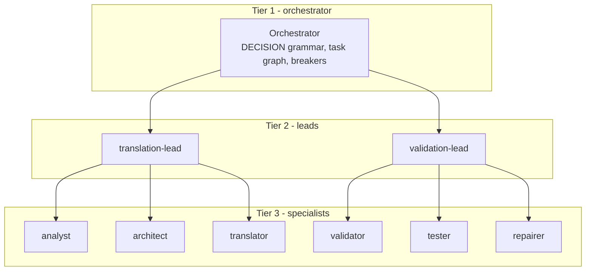
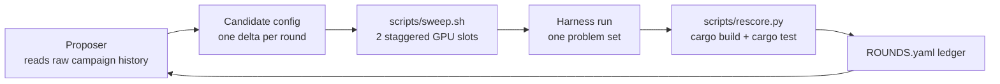

# ARCMiS

## Automated Rust migration for legacy C, Java, and Go codebases

  
<strong>ARCMiS team</strong>

  
Coverage sweep status: {{ "2026-10-02" }}

---
layout: default
---

# Contents

1. Introduction and problem description
2. Methodology
3. Inspirations
4. Benchmarks
5. References
6. Thank you

<!-- Section list of the deck -->

---
layout: section
---

# Introduction and problem description

---
layout: default
---

# The migration problem

- Real codebases still run on legacy C, Java, and Go.
- Safe, memory-checked Rust is the target language for new work.
- Hand migration is slow. Each project needs source reading, planning,
  translation, and test validation.
- A local 27B model can drive this work. A single LLM call cannot.
- ARCMiS answer: a harness of cooperating agents, a fixed problem set,
  and toolchain-only scoring.

<!-- Problem statement slide -->

---
layout: default
---

# What ARCMiS is

- A code-migration harness over the rig agent framework in Rust.
- Hierarchical multi-agent orchestration (ADR 0022, ADR 0026).
- One candidate config per problem set, one set at a time, LoC
  ascending.
- Every verdict comes from the toolchain: `cargo build` and
  `cargo test` through `scripts/rescore.py`. No model self-grading.
- Campaign method: the Meta-Harness loop (arXiv:2603.28052) proposes,
  runs, and scores harness changes against a fixed problem set.

<!-- Positioning slide -->

---
layout: section
---

# Methodology

---
layout: default
---

# The MAS hierarchy

- Tier 1 owns the round loop and the task graph.
- Tier 2 leads dispatch one member per round and read the result back.
- Config-owned team split: `mas.hierarchy` in
  `ARCMiS/lib/orchestrator/src/hierarchy.rs`, lead loop in `lead.rs`.

<!-- Hierarchy diagram slide -->

---
layout: default
---

# The coverage sweep pipeline

- Two staggered GPU slots plus a CPU proposer and scorer pipeline.
- Pairs: one crust rust-variant plus one non-crust set.
- Coverage rule: untouched projects only. A set counts once across
  retries.

<!-- Sweep pipeline slide -->

---
layout: section
---

# Inspirations

---
layout: default
---

# Orchestration patterns: the 2-axis taxonomy

**Source:** "LLM-Based Multi-Agent Orchestration: A Survey of Frameworks,
Communication Protocols, and Emerging Patterns" (the Q2 survey).

**Axes:** centralized / decentralized / hierarchy x static /
dynamic-adaptive.

**ARCMiS position: hierarchy x dynamic-adaptive.**

- Hierarchy: tier-2 leads over tier-3 specialists, config-owned
  (`hierarchy.rs`, `lead.rs`), ADR 0022 and ADR 0026.
- Dynamic: the task graph re-scores after each delegation, the router
  picks roles on intermediate state, and the orchestrator can spawn a
  failure-analyst to repairer sub-chain mid-task.
- Static agents: fixed registry, fixed preambles, fixed tool
  allowlists. Selection is dynamic, not the agents.

<!-- Taxonomy mapping slide -->

---
layout: default
---

# Modernization workflows

**ReCodeAgent** (arXiv:2604.07341, ASE 2026, vendored at
`assets/ReCodeAgent`):

- A multi-agent workflow for language-agnostic translation and
  validation of large repositories.
- Four specialized agents: analyzer, planner, translator, validator.
- ARCMiS borrows: the `tool_projects` dataset (114 problems in four
  families: crust, oxidizer, skel, alphatrans) and the four-stage
  pipeline discipline (ADR 0018, ADR 0022).

**Claude Modernization Plugin:**

- Discovery, brief, and execution flow with evidence-gated phase exits.
- ARCMiS borrows: the phase gate idea. A phase exit needs evidence,
  not a model claim.

<!-- Modernization workflow slide -->

---
layout: default
---

# System-one models: jev and laya

**1. LLM-as-a-judge.** A full model decode classifies an outcome. Cost:
one model turn per judgment, on the same busy GPU.

**2. Jev-as-a-judge.** A local specialist checkpoint does the same
judgment. In ARCMiS:

- `jev_judge.rs`: guard ask arbitration (ADR 0023).
- `jev_triage.rs`: per-dispatch triage of member results (ADR 0027).

**3. Typed decisions (laya, arXiv:2609.26550).** One forward pass
answers `choice`, `score`, and `noul` questions. No token decoding.
0 output tokens. See `.omp/skills/laya`.

**Bottleneck use - honest state:** the harness wires per-dispatch
triage with a min-confidence cascade (`TriageVerdict`, five
`agent_trace_observability` questions). The round policy defaults to
`observe`: verdicts get recorded, but no round stops on them.
Enforcement (`policy: enforce`) exists in `round_triage/policy.rs`
and is not the campaign default.

<!-- Judge slide with honest wiring state -->

---
layout: section
---

# Benchmarks

---
layout: default
---

# Dataset and progress

**Dataset:** ReCodeAgent `tool_projects` - 114 problems in the campaign
brief (counted directories: 119. Four families: crust 100, oxidizer 7,
skel 8, alphatrans 4).

**Progress (live from `.artifacts/experiments/ROUNDS.yaml`,
2026-10-02):**

- 39 ledger rounds this campaign. 17 solved, 13 not cleared,
  7 aborted, 2 in flight (v3s21 commons-csv, v3s25 bhshell).
- 12 unique problems cleared: leftpad plus 11 coverage sets (amp,
  ulidgen, gonameparts, avalanche, colorsys, morton, libqueue,
  murmurhash, geofence, gfc, 2dpartint).

<!-- Progress slide -->

---
layout: default
---

# Rate, estimate, and the ReCodeAgent record

**Estimated time to complete** (from the current rate):

- Campaign v3 started 2026-09-30, about 2.8 days elapsed.
- Rate: about 4.3 cleared problems per day.
- Remaining: about 24 days at this rate. This is an estimate, not a
  commitment. Engine stalls and 503 bursts moved the rate before.

**Published ReCodeAgent record (different protocol):**

| Technique | Result | Protocol |
|---|---|---|
| ReCodeAgent | 99.4% compile, 86.5% test pass | Claude 4.5 Sonnet, 118 projects, developer tests verified by the ReCodeAgent authors |
| ARCMiS v3 | 12 of 114 problems cleared | local Qwen3.8-27B, toolchain-only scoring, one set at a time |

The two rows are directional context, not a like-for-like comparison.
The model class, the budget, and the pass protocol differ.

<!-- Comparison slide with protocol label -->

---
layout: default
---

# References

- ReCodeAgent: A Multi-agent Workflow for Language-Agnostic Translation
  and Validation of Large-Scale Repositories. arXiv:2604.07341, ASE 2026.
- LLM-Based Multi-Agent Orchestration: A Survey of Frameworks,
  Communication Protocols, and Emerging Patterns. (the Q2 survey)
- Meta-Harness. arXiv:2603.28052.
- Typed decisions. arXiv:2609.26550. laya-rs crate, `.omp/skills/laya`.
- ARCMiS ADRs 0018, 0021, 0022, 0023, 0026, 0027 in `docs/adr/`.
- Dataset: `assets/ReCodeAgent/data/tool_projects`.
- Ledger: `.artifacts/experiments/ROUNDS.yaml`, `SUMMARY.md`.

<!-- Reference list slide -->

---
layout: end
---

# Thank you

ARCMiS - automated Rust migration

