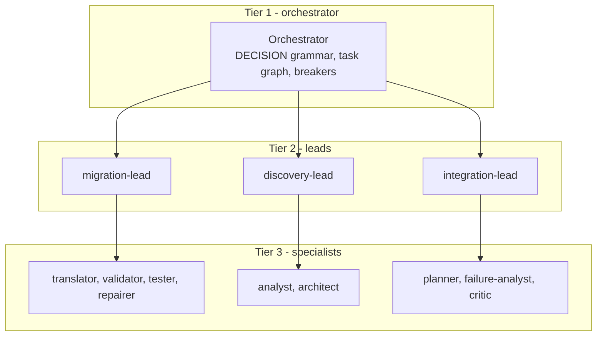
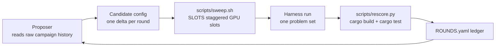

# ARCMiS

<!-- Engine: qwen3.8-27B on the local ninfer engine. The q27 excursion
     of 2026-10-02/03 was reverted; its results are invalidated. -->

## Automated Rust migration for legacy C, Java, and Go codebases

  
<strong>ARCMiS team</strong>

  
Coverage sweep status: 2026-10-04

<!-- Title slide. Author block bottom-left per the resdir master. -->

---
layout: default
---

# Contents

1. Introduction and problem description
2. Methodology
3. Inspirations
4. Benchmarks
5. References
6. Thank you

<!-- Section list of the deck -->

---
layout: section
title: Introduction and problem description
---

# Introduction and problem description

<!-- Section divider -->

---
layout: default
---

# The migration problem

- Real codebases still run on legacy C, Java, and Go.
- Safe, memory-checked Rust is the target language for new work.
- Hand migration is slow. Each project needs source reading, planning,
  translation, and test validation.
- A local 27B model can drive this work. A single LLM call cannot.
- The ARCMiS answer: a harness of cooperating agents, a fixed problem
  set, and toolchain-only scoring.

<!-- Problem statement -->

---
layout: default
---

# What ARCMiS is

- A code-migration harness over the rig agent framework in Rust.
- Hierarchical multi-agent orchestration (ADR 0022, ADR 0026).
- One candidate config per problem set, one set at a time, LoC
  ascending.
- Every verdict comes from the toolchain: `cargo build` and `cargo
  test` through `scripts/rescore.py`. No model self-grading.
- Campaign method: the Meta-Harness loop (arXiv:2603.28052) proposes,
  runs, and scores harness changes against a fixed problem set.

<!-- Positioning -->

---
layout: section
title: Methodology
---

# Methodology

<!-- Section divider -->

---
layout: default
---

# The MAS hierarchy

- Tier 1 owns the round loop and the task graph.
- Tier 2 leads dispatch members and read the result back.
- Config-owned team split under `mas.hierarchy`:
  `ARCMiS/lib/orchestrator/src/hierarchy.rs`, lead inner loop in
  `lead.rs`. Team names from the live v3r1 run config.

<!-- MAS hierarchy diagram. Verified files: hierarchy.rs, lead.rs. -->

---
layout: default
---

# The coverage sweep pipeline

- `scripts/sweep.sh` runs waves of `SLOTS` (default 2) staggered GPU
  slots, plus a CPU proposer and scorer pipeline. One candidate per
  set.
- Pairs: one crust rust-variant plus one non-crust set. Per-problem
  deltas live in `scripts/overrides/`.
- Coverage rule: untouched projects only. A set counts once across
  retries.
- Verdict from `scripts/rescore.py`: toolchain-only scoring.
- Round naming (commit e62c2f6): one problem can span several rounds.
  Rounds carry a global `autoopt-v0.3.s{N}` counter. A retry keeps its
  own ledger row, so the ledger records every attempt, not one row per
  problem.

<!-- Sweep pipeline diagram. -->

---
layout: section
title: Inspirations
---

# Inspirations

<!-- Section divider -->

---
layout: default
---

# Orchestration patterns: the 2-axis taxonomy

**Source:** "LLM-Based Multi-Agent Orchestration: A Survey of
Frameworks, Communication Protocols, and Emerging Patterns" (the Q2
survey).

**Axes:** centralized / decentralized / hierarchy x static /
dynamic-adaptive.

**ARCMiS position: hierarchy x dynamic-adaptive.**

- Hierarchy: tier-2 leads over tier-3 specialists. Verified in
  `ARCMiS/lib/orchestrator/src/hierarchy.rs` (tier-2 team resolution,
  config-owned under `mas.hierarchy`) and `lead.rs` (lead inner
  loop). Recorded in ADR 0022 and ADR 0026.
- Dynamic: the task graph re-scores after each delegation, the router
  picks roles on intermediate state, and the orchestrator can spawn a
  failure-analyst sub-chain mid-task.
- Static agents: fixed registry, fixed preambles, fixed tool
  allowlists. Selection is dynamic, not the agents.

<!-- Taxonomy mapping slide. Files verified before writing. -->

---
layout: default
---

# Modernization workflows

**ReCodeAgent** (arXiv:2604.07341, ASE 2026, vendored at
`assets/ReCodeAgent`):

- A multi-agent workflow for language-agnostic translation and
  validation of large repositories.
- ARCMiS borrows: the `tool_projects` dataset and the four-stage
  pipeline discipline (ADR 0018, ADR 0022).

**Claude Modernization Plugin:**

- Discovery, brief, and execution flow with evidence-gated phase
  exits.
- ARCMiS borrows: the phase gate idea. A phase exit needs evidence,
  not a model claim.

<!-- Modernization workflow slide. -->

---
layout: default
---

# System-one models: jev and laya

**1. LLM-as-a-judge.** A full model decode classifies an outcome.
Cost: one model turn per judgment, on the same busy GPU.

**2. Jev-as-a-judge.** A local specialist checkpoint does the same
judgment. In ARCMiS:

- `jev_judge.rs`: guard ask arbitration (ADR 0023).
- `jev_triage.rs`: per-dispatch triage of member results (ADR 0027).

**3. Typed decisions (laya, arXiv:2609.26550).** One forward pass
answers `choice`, `score`, and `noul` questions. No token decoding.
See `.omp/skills/laya`.

**Bottleneck use - honest state:** the harness wires per-dispatch
triage with a min-confidence cascade (`TriageVerdict` from five
`agent_trace_observability` questions). The round policy defaults to
`observe`: verdicts get recorded, but no round stops on them.
Enforcement (`policy: enforce`) exists in `round_triage/policy.rs`
and is not the campaign default.

<!-- Judge slide with honest wiring state. Verified: jev_triage.rs,
     round_triage/policy.rs, TriagePolicy default = Observe. -->

---
layout: section
title: Benchmarks
---

# Benchmarks

<!-- Section divider -->

---
layout: default
---

# Dataset and progress

**Dataset:** ReCodeAgent `tool_projects` - the campaign brief says 114
problems. Counted directories: **119** (alphatrans 4, crust 100,
oxidizer 7, skel 8). Delta: 5 uncounted problems. Numbers below use
the brief's 114.

**Progress** (live from `.artifacts/experiments/ROUNDS.yaml` and
`SUMMARY.md`, read 2026-10-04):

- 47 ledger rounds: 19 SOLVED, 16 NOT CLEARED, 10 ABORTED, 2 in
  flight. A problem can span several rounds; retries keep their own
  rows.
- Engine: **qwen3.8-27B on the local ninfer engine**. The q27
  excursion (2026-10-02 to 03) produced zero clears and was reverted;
  its results are invalidated.
- Live: wave 1 of the coverage sweep, 18 problems, 2 staggered GPU
  slots (remimu, heapq in flight).
- **13 of 114 problems cleared** (leftpad, amp, ulidgen,
  gonameparts, avalanche, colorsys, morton, libqueue, murmurhash,
  geofence, gfc, 2dpartint, bhshell). A problem counts once across
  retries.

<!-- Progress slide. Live numbers read at build time. -->

---
layout: default
---

# Rate, estimate, and the ReCodeAgent record

**Estimated time to complete** (from the current rate; estimate, not
a commitment):

- The campaign opened 2026-09-26. About 8 days elapsed to
  2026-10-04.
- Rate: 13 cleared / 8 days = about 1.6 per day.
- Remaining: (114 - 13) / 1.6 = about 62 days.

**Published ReCodeAgent record (different protocol):**

| Technique | Result | Protocol |
|---|---|---|
| ReCodeAgent | 99.4% compile, 86.5% test pass | Claude 4.5 Sonnet, 118 projects, their developer-test suites |
| ARCMiS v3 | 13 of 114 problems cleared | qwen3.8-27B on the local ninfer engine, toolchain-only scoring, one set at a time |

The two rows are directional context, not a like-for-like
comparison. The model class, the budget, and the pass protocol
differ.

<!-- Comparison slide with protocol label. -->

---
layout: default
---

# References

- ReCodeAgent: A Multi-agent Workflow for Language-Agnostic
  Translation and Validation of Large-Scale Repositories.
  arXiv:2604.07341, ASE 2026.
- LLM-Based Multi-Agent Orchestration: A Survey of Frameworks,
  Communication Protocols, and Emerging Patterns. (the Q2 survey)
- Meta-Harness. arXiv:2603.28052.
- Typed decisions. arXiv:2609.26550. laya-rs crate, `.omp/skills/laya`.
- ARCMiS ADRs 0018, 0022, 0023, 0026, 0027, 0028 in `docs/adr/`.
- Dataset: `assets/ReCodeAgent/data/tool_projects`.
- Ledger: `.artifacts/experiments/ROUNDS.yaml`, `SUMMARY.md`.

<!-- Reference list slide. -->

---
layout: end
---

# Thank you

<!-- Closing slide. -->
